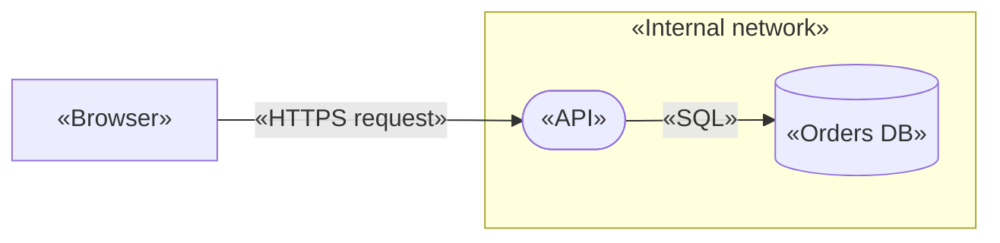

# Contract: Report documents

Both documents render the same report model (data-model.md §2), in the same order. `«x»` marks user
text, which is escaped as research #8 (Markdown), #9 (Mermaid) and #10 (HTML) say. Everything else
is fixed wording. The sample below is abbreviated.

## Shared outline

1. **Title and header**: threat model name, project, methodology, threat model status, exported at
   (UTC), and the element, threat and mitigation counts.
2. **Risk summary**: two tables. Threats by status (Open, Mitigated, Accepted, Not applicable), and
   open threats by risk (Critical, High, Medium, Low). Each has a total row.
3. **Diagram**: an SVG in HTML; a Mermaid flowchart or FR-007a's note in Markdown.
4. **Elements**: boundary groups, depth-first (data-model.md §2). Each group has:
   - a heading;
   - the boundary's own threats;
   - its element sections;
   - its nested groups.

   Then the outside group, "Outside any trust boundary". Every element section has:
   - a heading with its reference, type and name;
   - a properties list (tags, flags; for a flow, its ends and whether it crosses a boundary);
   - its threats, or "No threats."
5. **Threats not linked to an element**: the model-level threats, or "None."

Each threat shows:

- a heading with its title;
- a facts list: category, risk (with likelihood × impact), status, reason, origin, and the stale and
  gap markers when they apply;
- its description;
- its mitigations (status, description, ticket), or "No mitigations."

An empty threat model still produces every section, with "No elements." / "No threats." in place of
the content (US1 scenario 5).

## Markdown

~~~~markdown
# Threat model report: «Payments API»

- **Project:** «Checkout»
- **Methodology:** STRIDE
- **Threat model status:** In review
- **Exported:** 2026-10-10 14:03 UTC
- **Contents:** 12 elements, 41 threats, 77 mitigations

## Risk summary

| Status | Threats |
|---|---:|
| Open | 22 |
| Mitigated | 11 |
| Accepted | 5 |
| Not applicable | 3 |
| **Total** | **41** |

| Risk (open threats) | Threats |
|---|---:|
| Critical | 2 |
| High | 7 |
| Medium | 9 |
| Low | 4 |
| **Total** | **22** |

## Diagram



## Elements

### E1 · Trust boundary · «Internal network»

#### E2 · Process · «API»

- **Tags:** «Node.js», «Express»
- **Internet facing:** Yes
- **Requires authentication:** Yes
- **Handles sensitive data:** Not assessed
- **Runs privileged:** No

##### «Session token replay» — High

- **Category:** Spoofing
- **Risk:** High (likelihood High × impact Medium)
- **Status:** Accepted
- **Reason:**
  > «Tokens expire after 5 minutes; residual risk accepted by the platform team.»
- **Origin:** Rule-generated
- **Stale:** «The rule no longer applies: …» *(only when stale)*
- **Missing:** an implemented or verified mitigation *(only when the status lacks it)*

> «Description, line 1»\
> «line 2»

**Mitigations**

1. **Implemented** — «Bind tokens to the session»\
   Ticket: <https://tracker.example/SEC-12>
2. **Proposed** — «Rotate signing keys» — Ticket: «JIRA-7» *(not a web address: plain text)*

#### E4 · Data flow · «SQL»

- **From:** E2 «API» **to:** E3 «Orders DB»
- **Crosses a trust boundary:** No
- …

No threats.

### Outside any trust boundary

#### E5 · External entity · «Browser»
…

## Threats not linked to an element

None.
~~~~

Fixed rules:

- **Heading levels**: `#` title; `##` top sections; `###` boundary groups, with nested boundaries
  still at `###` and their full path in the heading: `E7 · Trust boundary · «Outer» › «Inner»`; `####` element; `#####`
  threat. Markdown has only six levels, so the path carries the nesting instead of deeper headings.
- **The heading of a boundary's own threats**: `#### Threats of this boundary`, omitted when there
  are none.
- **FR-007a's note**, in place of the fenced block:
  `> The diagram has 1000 elements and is too large to draw here. Its structure is listed under Elements below; the HTML report from Specter draws it in full.`
- **Line endings**: LF, and exactly one final newline (research #7).

## HTML

```html
<!doctype html>
<html lang="en">
<head>
<meta http-equiv="Content-Security-Policy" content="default-src 'none'; style-src 'sha256-…'; img-src 'none'; base-uri 'none'; form-action 'none'">
<meta charset="utf-8">
<meta name="referrer" content="no-referrer">
<meta name="viewport" content="width=device-width, initial-scale=1">
<title>Threat model report: «Payments API»</title>
<style>/* the report-css.ts constant, embedded verbatim; its bytes are what the hash covers */</style>
</head>
<body>
<header>…the same header facts as a <dl>…</header>
<section aria-labelledby="summary">…two <table>s with <caption>, <th scope>…</section>
<section aria-labelledby="diagram">
  <figure>
    <svg role="img" aria-labelledby="diagram-caption" viewBox="…">…</svg>
    <figcaption id="diagram-caption">Data flow diagram. Every element and flow is listed under Elements below.</figcaption>
  </figure>
</section>
<section aria-labelledby="elements">
  <section class="group">…<article class="element">…<article class="threat">…</article></article></section>
</section>
<section aria-labelledby="unlinked">…</section>
</body>
</html>
```

Fixed rules:

- **Same outline and wording as the Markdown.** Boundary groups nest as `<section>`s, and headings
  stop at `h6` like the Markdown's.
- **Markers are words, never colour alone (FR-020)**:
  - status and risk are written as text, in a bordered badge whose border style differs by value
    (solid, double, dashed, dotted);
  - "Stale" and "Missing" are labelled text.
- **Print (FR-019)**:
  - `@page { margin: 16mm }`;
  - `.threat`, `table`, `figure` and a heading with its first following block use
    `break-inside: avoid` / `break-after: avoid`;
  - the figure starts on a new page;
  - links print their address, because the address is the link text;
  - there are no app controls to hide, since the file has none.
- **Screen**: readable at 320 px wide, with the figure scrolling sideways when needed.
- **The SVG** is drawn as research #11 says:
  - shapes per type;
  - dashed boundaries drawn outermost first;
  - flows as lines with an arrowhead `<marker>`;
  - flow labels beside their line (above a flow that runs across, to its right if it runs straight
    up or down, on opposite sides for flows that share two shapes), with a thin white outline on the
    text and no box behind it;
  - flows that share two shapes spread over at most 48 units in all, so every line meets both;
  - truncated labels with a `<title>`.

## Escaping fixtures (unit and browser tests)

The hostile fixture puts each of these strings into every user text field: names, tags, titles,
descriptions, reasons, mitigation descriptions and tickets.

```text
# Heading?          | pipe | in | text |       *emphasis* _under_ ~~strike~~
[link](https://evil.example)      <https://evil.example>
https://evil.example   www.evil.example   user@evil.example
<script>window.__ran = 1</script>      <b>bold</b>
`code`  ```fence```   --> end subgraph   "quotes" 'single'   #35; &amp; &lt;   \backslash\
1. not a list    - not a list    > not a quote        (four leading spaces)
line one⏎line two⏎⏎paragraph after a blank line
javascript:alert(1)   data:text/html,<script>alert(1)</script>   (as ticket links)
```

**Expected in every renderer**:

- each string reads back exactly;
- the only links are the http/https tickets the report itself emits;
- no image, script, heading, list, table or code element comes from user text;
- `window.__ran` stays undefined;
- `javascript:` and `data:` tickets are plain text.
